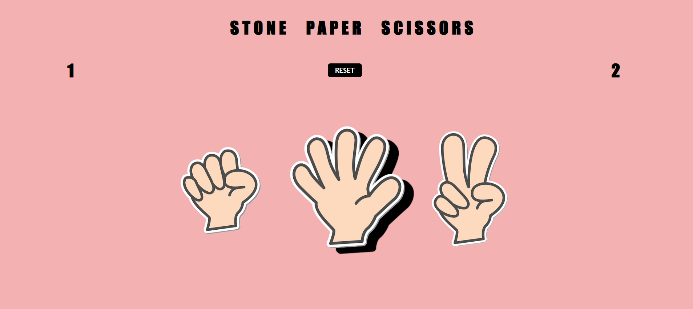
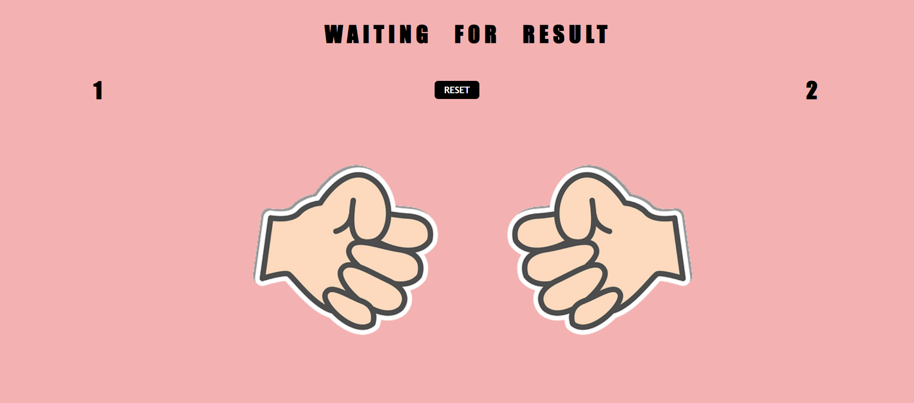
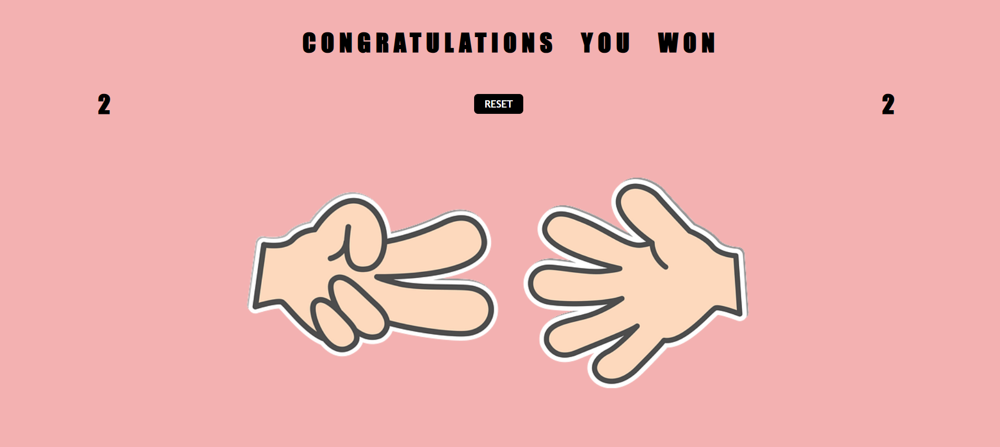

<h1 align="center">Stone-Paper-Scissors</h1>
<h3 align="center">The familiar game of Rock, Paper, Scissors is played like this: at the same time, two players display one of three symbols: a rock, paper, or scissors. A rock beats scissors, scissors beat paper by cutting it, and paper beats rock by covering it.</h3>


[](https://github.com/Devvlos/Stone-Paper-Scissors)
[](https://devvlos.github.io/Stone-Paper-Scissors/)
[](https://adhishgupta.rf.gd/)
[](https://github.com/Devvlos/Stone-Paper-Scissors)


<p align="center">
  <a href="#-about-the-project">About the project</a>&nbsp;&nbsp;&nbsp;|&nbsp;&nbsp;&nbsp;
  <a href="#-getting-started">Getting started</a>&nbsp;&nbsp;&nbsp;|&nbsp;&nbsp;&nbsp;
  <a href="#-how-to-contribute">How to contribute</a>&nbsp;&nbsp;&nbsp;|&nbsp;&nbsp;&nbsp;
</p>

---

<p align="center">
  
  <br>
  
  <br>
  
</p>

---

## 💡 About the project

This is an open source project that serves as a free alternative to the Linktree website.
- [Demo](https://devvlos.github.io/Stone-Paper-Scissors/)

## 🚀 Getting started

If you installed git you can clone the code to your machine, or download a ZIP of all the files directly.
[Download the ZIP from this location](https://github.com/Devvlos/Stone-Paper-Scissors/archive/refs/heads/main.zip), or run the following [git](https://git-scm.com/downloads) command to clone the files to your machine:
```bash
git clone https://github.com/Devvlos/Stone-Paper-Scissors.git
```
- Once the files are on your machine, open the _linktree_ folder in [Visual Studio Code](https://code.visualstudio.com/).
- With the files open in Visual Studio Code, press the **Go Live** button at the bottom of the window to launch the files with [Live Server](https://marketplace.visualstudio.com/items?itemName=ritwickdey.LiveServer).

## 🤔 How to contribute

- Fork this repository;
- Create a branch with your feature: `git checkout -b my-feature`;
- Commit your changes: `git commit -m "feat: my new feature"`;
- Push to your branch: `git push origin my-feature`.

Once your pull request has been merged, you can delete your branch.


Made By Devlos :wave: [Contact](https://adhishgupta.netlify.app/)
